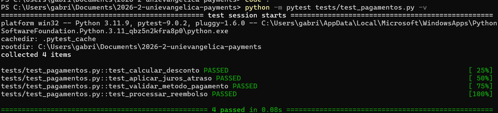

## 📋 Identificação do Aluno

> ⚠️ **ATENÇÃO:** PRs sem preenchimento correto desta seção **não serão avaliados.**

| Campo | Valor |
|:---|:---|
| **Nome completo** | <!-- Gabriel Francisco Vaz Azevedo --> |
| **Matrícula** | <!-- 2313079 --> |
| **Turma** | <!-- B --> |
| **Nome da branch** | <!-- pratica11/GabrielFrancisco-2313079 --> |

---

## ✅ Checklist de Entrega

Marque todos os itens antes de submeter:

- [X] A branch segue o padrão `pratica11/NomeSobrenome-Matricula`
- [X] O bug de `test_aplicar_juros_atraso` foi identificado e corrigido
- [X] `test_validar_metodo_pagamento` implementado com ≥ 2 asserts (aceito e rejeitado)
- [X] `test_processar_reembolso` implementado com ≥ 2 asserts (válido e -1)
- [X] Todos os testes passam (`python -m pytest tests/test_pagamentos.py -v`)
- [X] Screenshot do terminal com os testes `PASSED` está anexada abaixo

---

## 🖼️ Screenshot dos Testes Passando

> Arraste a imagem aqui ou cole com Ctrl+V. O terminal deve mostrar `X passed` em verde.

<!--  -->

---

## 📝 Explicação Técnica (obrigatório — mínimo 3 frases)

> Não é apenas entregar o código. Explique com suas palavras o que você entendeu.

**1. Por que o teste `test_aplicar_juros_atraso` estava falhando?**

<!-- O teste estava falhando porque a asserção esperava um valor incorreto (150.0), enquanto a função implementa juros simples de 1% ao dia. Para um valor de 100 com 5 dias de atraso, o cálculo correto é 100 + (100 * 0.01 * 5) = 105.0. Ou seja, o erro não estava na função, mas sim na expectativa do teste, que não respeitava a regra de negócio definida. -->

**2. Qual a diferença entre um Stub e um Mock? Use um exemplo do contexto de pagamentos.**

<!-- Um Stub é usado para simular uma resposta fixa de uma dependência, sem se preocupar com como ela foi chamada. Já um Mock além de simular o comportamento, também verifica interações, como quantas vezes uma função foi chamada ou com quais parâmetros.
Exemplo: em um sistema de pagamentos, um Stub poderia simular a resposta de um banco retornando sempre “pagamento aprovado”. Já um Mock poderia verificar se a função de envio de pagamento foi chamada exatamente uma vez com o valor correto e o método (ex: PIX). -->

**3. O que é Branch Coverage e por que ela é mais rigorosa que Statement Coverage?**

<!-- Branch Coverage mede se todos os caminhos possíveis de decisão (if/else, condições) foram testados, enquanto Statement Coverage apenas verifica se cada linha de código foi executada pelo menos uma vez. Isso torna o Branch Coverage mais rigoroso, pois garante que todas as bifurcações lógicas foram validadas, incluindo cenários positivos e negativos. Por exemplo, na função de reembolso, não basta executar a linha do if, é necessário testar tanto o caso em que o valor é válido quanto quando ultrapassa o limite e retorna -1. -->

---

## 🔗 Referência Bibliográfica usada

> Cite ao menos uma referência (Delamaro, Pytest docs, Martin Fowler, etc.)

<!-- Maurício Delamaro — Introdução ao Teste de Software. Capítulos sobre critérios de cobertura (caixa-branca). -->

---

*Qualquer PR com campos vazios ou sem a explicação técnica será marcado como **incompleto** e não receberá nota.*
